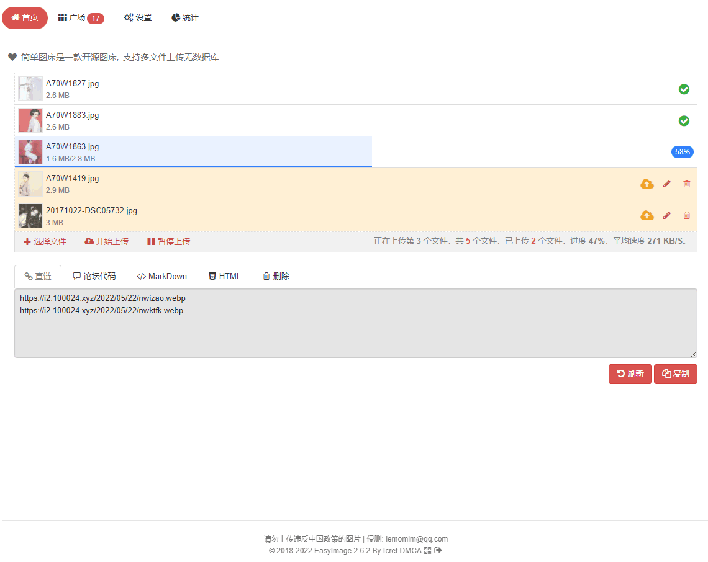
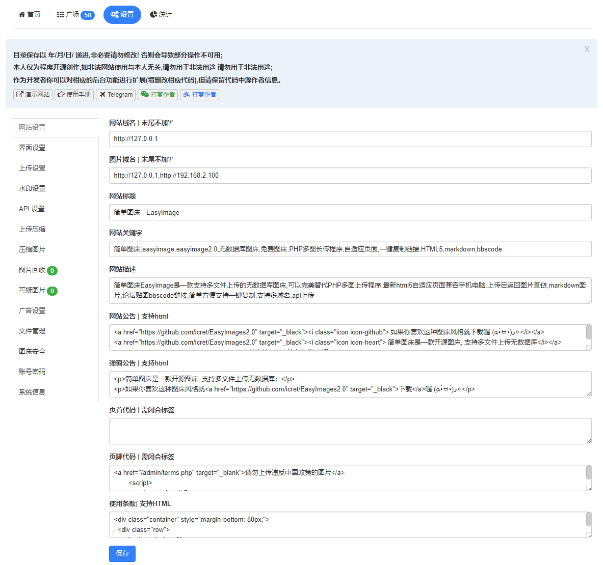
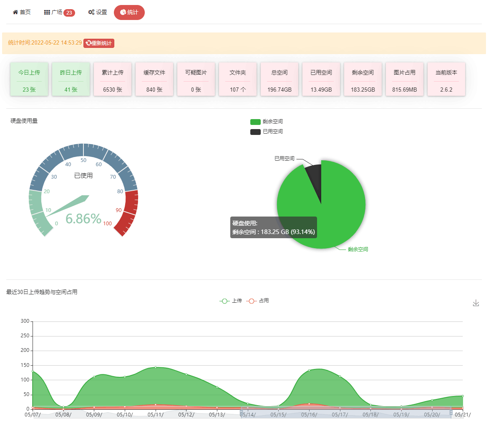
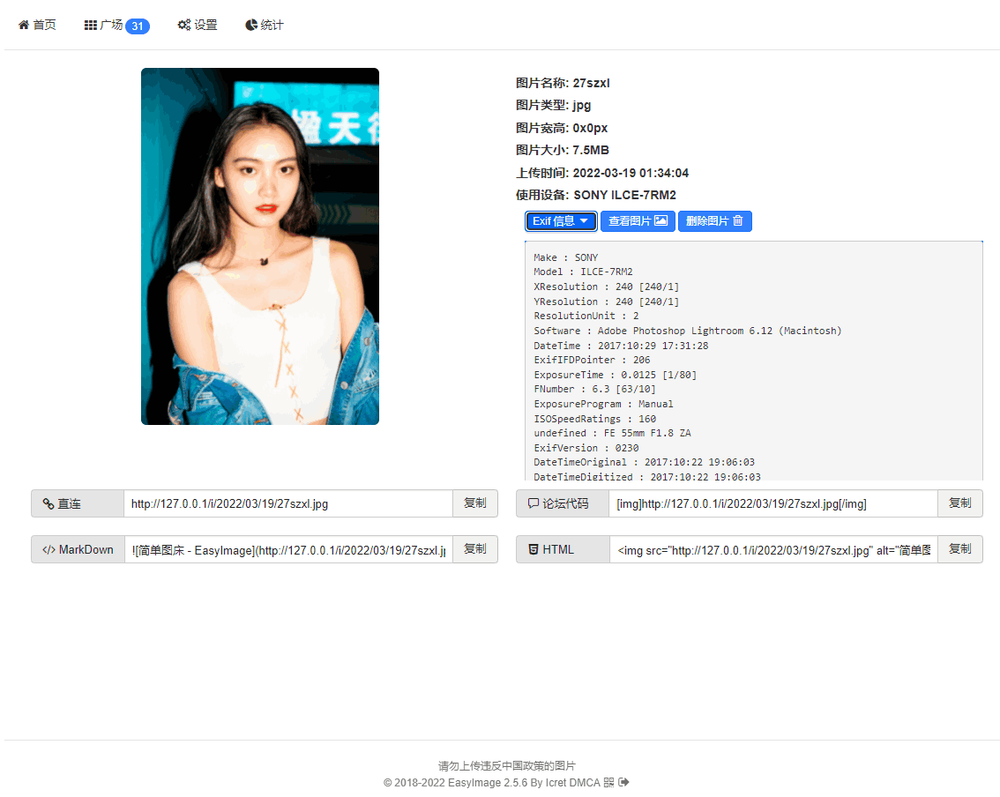
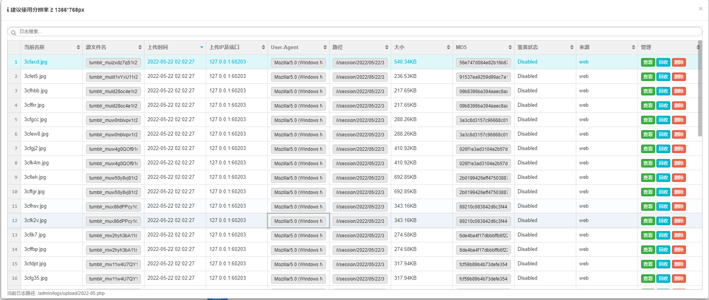

## EasyImage2.0 简单图床

[](https://github.com/Redstonexs/easyimages/stargazers)
[](https://github.com/Redstonexs/easyimages/network/members)
[](http://php.net)
[](https://golang.org)
[](https://github.com/Redstonexs/easyimages/releases)
[](https://cdn.jsdelivr.net/gh/Redstonexs/easyimages@master/)
[](https://github.com/Redstonexs/easyimages/blob/master/LICENSE)
[](https://jq.qq.com/?_wv=1027&k=jfXRHU8Y)

[演示](https://png.cm/) · [手册](https://icret.github.io/EasyImages2.0/#/) · [社区](https://github.com/Redstonexs/easyimages/discussions) · [Telegram](https://t.me/Easy_Image) - 插件: [Chrome](./Chrome插件.md) · [Edge](./Edge插件.md) · [PicGo](/使用PicGo上传.md) · [ShareX](./使用ShareX上传.md) · [Docker](/docs/三方安装指南.md)

目录: [安装](./安装图床.md) | [安全](./安全配置.md) | [API](./API.md) | [鉴黄](./鉴黄.md) | [升级](./图床更新升级.md) | [Go版本迁移](./从PHP迁移到Go版本.md) | [常见问题](./常见问题.md) | [环境/兼容](#环境要求) | [更新日志](./update.md) | [打赏开发者](./打赏开发者.md) | [鸣谢](#鸣谢) | [许可证](#开源许可)

> 始于2018年7月，支持多文件上传,简单无数据库,返回图片url,markdown,bbscode,html的一款图床程序
演示地址：[https://png.cm/](https://png.cm/)
之前一直用的图床程序是:[PHP多图长传程序2.4.3](https://www.jb51.net/codes/40544.html)
由于版本过老并且使用falsh上传，在当前html5流行大势所趋下，遂利用基础知识新写了一个以html5为默认上传并且支持flash,向下兼容至IE9。
***本程序环境要求极低，适用于单一场景（游客上传）和个人使用，不适于多用户复杂场景***
>本人善写bug 发现bug可提交 [issues](https://github.com/Redstonexs/easyimages/issues) 追求稳定请下载 [稳定版](https://github.com/Redstonexs/easyimages/releases)

### Go语言版本

现已提供Go语言重构版本，具有以下优势：
- 更高性能，更低资源占用
- 单二进制文件部署，无需PHP环境
- 官方Docker镜像支持
- 完全兼容PHP版本的数据和配置
- **自动迁移功能** - 检测到PHP配置自动执行迁移

**快速开始：**
```bash
# 编译Go版本
go build -o easyimage

# 运行（自动检测PHP配置并迁移）
./easyimage
```

**从PHP版本迁移（自动）：**
```bash
# 1. 复制PHP配置文件到config目录
cp /path/to/php/config/config.php config/

# 2. 编译并运行（自动迁移）
go build -o easyimage
./easyimage
```

**从PHP版本迁移（手动）：**
```bash
# 编译配置转换工具
cd cmd/php2json && go build -o php2json

# 转换配置文件
./php2json ../../config/config.php ../../config/config.json
```

**Docker部署（自动迁移）：**
```bash
# 1. 复制PHP配置文件到config目录
cp /path/to/php/config/config.php config/

# 2. 启动Docker（自动迁移）
docker-compose up -d
```

**迁移测试工具：**
```bash
# 编译并运行迁移测试工具
cd cmd/migrate_test && go build -o migrate_test
./migrate_test
```

详细迁移说明请参考：[从PHP迁移到Go版本](./从PHP迁移到Go版本.md)

## 特点

* [x] 支持API
* [x] 支持仅登录后上传
* [x] 支持设置图片质量
* [x] 支持压缩图片大小
* [x] 支持文字/图片水印
* [x] 支持设置图片指定宽/高
* [x] 支持上传图片转换为指定格式
* [x] 支持限制最低宽度/高度上传
* [x] 支持上传其他文件格式
* [x] 在线管理图片
* [x] 支持网站统计
* [x] 支持设置广告
* [x] 支持图片鉴黄
* [x] 支持自定义代码
* [x] 支持上传IP黑白名单
* [x] 支持上传日志IP定位
* [x] 支持限制日上传次数
* [x] 支持创建仅上传用户
* [x] 对于安装环境要求极低
* [x] 对于服务器性能要求极低
* [x] 理论上[支持所有常见格式](./其他格式.md)
* [x] 更多功能支持请安装尝试···

 ## 界面演示
 
 
 
 
 
 
 

## 环境要求

### PHP版本
> 推荐环境：Nginx + PHP≥7.0 + linux

- ##### 兼容

 >最低`PHP 5.6`,推荐`PHP≥7.0`及以上版本，需要PHP支持`Fileinfo,iconv,zip,mbstring,openssl`扩展,如果缺失会导致无法上传/删除图片
 文件上传视图提供文件列表管理和文件批量上传功能，允许拖拽（需要`HTML5`支持）来添加上传文件，支持上传大图片，优先使用`HTML5`旧得浏览器自动使用`Flash和Silverlight`的方式兼容

### Go版本
> 推荐环境：Go 1.21+ / Docker

- **直接运行：** `go build -o easyimage && ./easyimage`
- **Docker运行：** `docker-compose up -d`
- **自动迁移：** 检测到PHP配置自动执行迁移
- **迁移工具：** `cmd/php2json` (手动转换PHP配置)
- **迁移测试：** `cmd/migrate_test` (测试迁移配置)

详细迁移说明请参考：[从PHP迁移到Go版本](./从PHP迁移到Go版本.md)

## 鸣谢
 
- [verot](https://github.com/verot/class.upload.php "verot" )
- [ZUI](https://github.com/easysoft/zui/tree/zui1 "ZUI" )
  
## 开源许可

 - [GPL-2.0](https://github.com/Redstonexs/easyimages/blob/master/LICENSE)
 - Copyright © 2018 EasyImage Developer By [Icret](https://github.com/icret)
 
* have fun!

[](https://github.com/Redstonexs/easyimages/stargazers)
